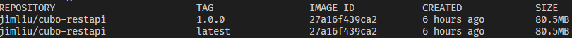
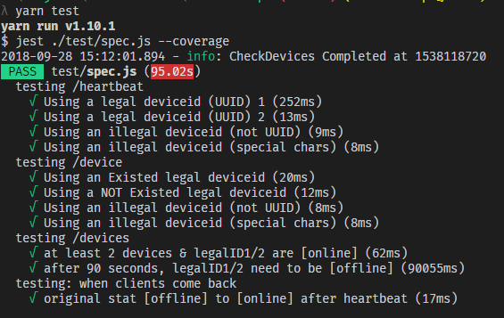
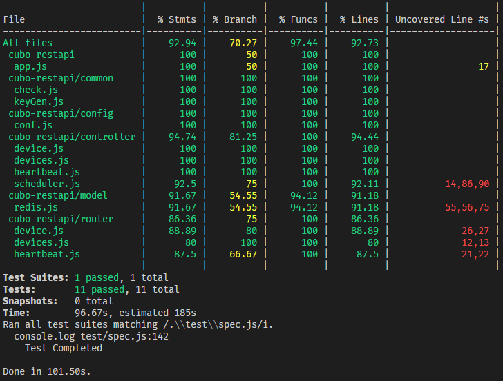

# cubo-restapi

## API

|METHOD| ROUTER| Description |
|:-|:-|:-|
|`POST`| /heartbeat/**<device_id>** |提供**裝置**定期呼叫確認連線狀況|
|`GET` | /device/**<device_id>** |提供 Client 確認單一**裝置**狀況|
|`GET` | /devices/ |提供 Client 確認所有**裝置**清單及狀況|

## API Return Code

|API| StatusCode | Description |
|:-|:-|:-|
|*heartbeat* | 200 |  OK |
| | 400 | Not a legel UUID |
|*device* | 200 | 回傳單則 **DeviceInfo** |
| | 204 | 查無此 deviceid 資料 |
| | 400 | Not a legel UUID |
|*devices* | 200 |  回傳 **DeviceInfo** Array |

## Return Data

* **DeviceInfo** Structure

    ```js
    {
        deviceid:   'string',   // [UUID] device unique id
        heartbeat:  'int',      // [10 digit] last updated heartbeat in Unix Time Stamp (to Second)
        inonline:   'int',      // [1 digit] 0:offline, 1:online
    }
    ```

## Build Docker Image

```bash
  yarn build
```



## Deploy Docker Container

```bash
  # 可以自行指定對外 port
  # 可以自行指定 logs 資料夾 mapping 位置，方便取用 logs
  docker run -d -p 8080:80 \ 
   --name jimliu/cubo-api \ 
   -v ./log:/var/app/logs \ 
   jimliu/cubo-restapi:latest
```

## Unit Test

```bash
  yarn test
```





* 因其中有一項測試為 **「經過逾時時間後，device是否正確設為 offline」**，故以 `setTimeout` 將測試項目時間拉長。 *(時間長度設為 expiredSec + checkMin )*
  * 如需加快此項測試，可至 [./config/conf.js](./config/conf.js) 將 expiredSec 及 checkMin 設為較短的時間。
  * 如不需測試此項，可將此項測試註解，可大幅縮短測試時間。

## DB Schema

Key 分配詳情請參考 [./common/keyGen.js](./common/keyGen.js)

|Key|DataType|Description|
|:-|:-|:-|
|HB:**[deviceid]**|*String*|紀錄每個裝置最後一次Heartbeat時間，表示方式: Unix Time Stamp (10碼數字) |
|Online|*Set*|紀錄目前 Online 的所有裝置 deviceid |
|Warning|*ZSet*|紀錄 Offline 裝置發送 Webhook Alert 的次數 |
